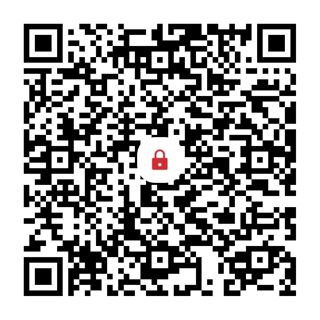
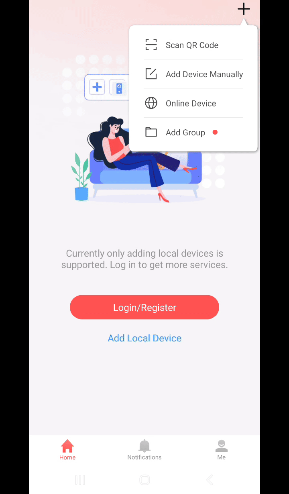
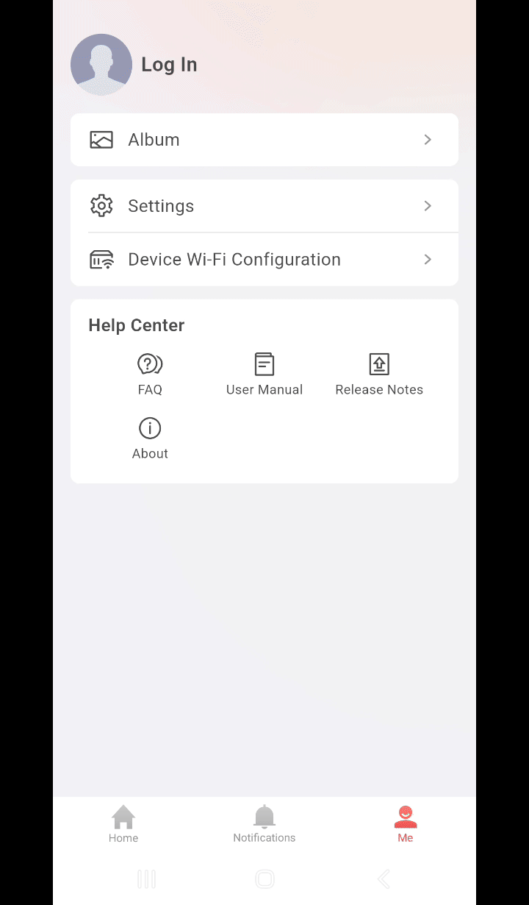

# HikVision QR export decoder



## Usage
```bash
$ git clone git@github.com:maxim-smirnov/hik-qr-export.git
$ cd hik-qr-export
$ python3 -m venv venv  # Create new virtual environment
$ source venv/bin/activate  # Activate venv
$ pip install -r requirements.txt  # Install requirements 
$ python hik_qr_export.py --help
Usage: hik_qr_export.py [OPTIONS] COMMAND [ARGS]...

Options:
  --help  Show this message and exit.

Commands:
  decode  Decode QR code data, extract metadata and stored devices.
  renew   Renew QR code.
```

# What and why?

## Intro

I forgot password from my HikVision camera. But this camera was added to
application called **Hik-Connect** and I still had access to my camera with
this app. But the password for device is hidden in the app.

So I began looking for a way to extract the password for my camera.

There is an option in **Hik-Connect** application to export local devices.
The app will ask you to set end-to-end encryption password 
to protect your exported devices. Well, there is an encryption used, 
but with a static key hardcoded into application. 

So it's possible to decode and decrypt exported data without export password you set.

And if you forgot your export password it's also possible to restore it!

(Your password is not even hashed, it's also encrypted with static key)

## Adding local device to application
Just press **+** in top right corner and select **"Add Device Manually"**.



## Exporting local devices
Switch to **Me** tab and scroll down till **"Export Local Devices""** option.
Select devices you want to export and then **"Generate QR Code"** at the bottom.

You will be asked to enter the password for your QR code. 
This password will be asked on the other phone when you will scan 
this QR with **Hik-Connect** app.

Also, QR code has an expiration period.



We will talk about password and exp. period a little later.

## QR Code Structure
Let's scan QR code I created for dummy camera and see what's inside.
`QRC03010003eJwrKnNNzC0vNy/yLogwD041LTUocg13tLW1ijRyK4mK8MpQM1DzDcmu9MlyNfJ3NqkA0rZqFgYGBmpqySWGuSYp5iEVwc5eHkZJHpnhWcFBQK04JVSsjJO8g5IC0gMSU6KcqsxczEuzjfQNA21tAQ4rKR0=`

Well, not so bad. 
We can clearly see the **Header** which is: `QRC03010003`

May be it's QR code structure format or name of the application which created this QR.

After the header we can see `base64` encoded data: `eJwrKnNNzC0vNy/yLogwD041LTUocg13tLW1ijRyK4mK8MpQM1DzDcmu9MlyNfJ3NqkA0rZqFgYGBmpqySWGuSYp5iEVwc5eHkZJHpnhWcFBQK04JVSsjJO8g5IC0gMSU6KcqsxczEuzjfQNA21tAQ4rKR0=`

Let's decode it and save the output to some file:
```bash
$ echo -n 'eJwrKnNNzC0vNy/yLogwD041LTUocg13tLW1ijRyK4mK8MpQM1DzDcmu9MlyNfJ3NqkA0rZqFgYGBmpqySWGuSYp5iEVwc5eHkZJHpnhWcFBQK04JVSsjJO8g5IC0gMSU6KcqsxczEuzjfQNA21tAQ4rKR0=' | base64 -d > /tmp/b64_decoded
```
So what's inside there...
```bash
$ cat /tmp/b64_decoded | hexdump -C
00000000  78 9c 2b 2a 73 4d cc 2d  2f 37 2f f2 2e 88 30 0f  |x.+*sM.-/7/...0.|
00000010  4e 35 2d 35 28 72 0d 77  b4 b5 b5 8a 34 72 2b 89  |N5-5(r.w....4r+.|
00000020  8a f0 ca 50 33 50 f3 0d  c9 ae f4 c9 72 35 f2 77  |...P3P......r5.w|
00000030  36 a9 00 d2 b6 6a 16 06  06 06 6a 6a c9 25 86 b9  |6....j....jj.%..|
00000040  26 29 e6 21 15 c1 ce 5e  1e 46 49 1e 99 e1 59 c1  |&).!...^.FI...Y.|
00000050  41 40 ad 38 25 54 ac 8c  93 bc 83 92 02 d2 03 12  |A@.8%T..........|
00000060  53 a2 9c aa cc 5c cc 4b  b3 8d f4 0d 03 6d 6d 01  |S....\.K.....mm.|
00000070  0e 2b 29 1d                                       |.+).|
00000074
$ file /tmp/b64_decoded
/tmp/b64_decoded: zlib compressed data
```
Not bad, but this compressed data has no header, so `zcat` will say that it's not gzip format.

I used python to decompress the data, but there are a lot of other ways to do that.
```python
>>> import base64
>>> import zlib
>>> zlib.decompress(base64.b64decode('eJwrKnNNzC0vNy/yLogwD041LTUocg13tLW1ijRyK4mK8MpQM1DzDcmu9MlyNfJ3NqkA0rZqFgYGBmpqySWGuSYp5iEVwc5eHkZJHpnhWcFBQK04JVSsjJO8g5IC0gMSU6KcqsxczEuzjfQNA21tAQ4rKR0='))
b'rvEamww7rKpX7Se5u0rEWA==:Y2FtZXJh&0&MTkyLjE2OC4xLjE=&8000&&ct1m4d7TxSCJH2bHiWjSRA==&ct1m4d7TxSCJH2bHiWjSRA==$:3bKRbPgPadZBz6D7uk2/1Q=='
```

We can clearly see some structure here. Let's try to decode it:

<table>
    <tr><th>Encoded</th><th>Decoded</th></tr>
    <tr><td><code>rvEamww7rKpX7Se5u0rEWA==</code></td><td><code>\xae\xf1\x1a\x9b\x0c;\xac\xaaW\xed'\xb9\xbbJ\xc4X</code></td></tr>
    <tr><th colspan="2"><code>:</code> separator</th>
    <tr><td><code>Y2FtZXJh</code></td><td><code>camera</code></td></tr>
    <tr><td colspan="2"><code>&</code> separator</td>
    <tr><td colspan="2"><code>0</code> not encoded</td></tr>
    <tr><td colspan="2"><code>&</code> separator</td>
    <tr><td><code>MTkyLjE2OC4xLjE=</code></td><td><code>192.168.1.1</code></td></tr>
    <tr><td colspan="2"><code>&</code> separator</td>
    <tr><td colspan="2"><code>8000</code> not encoded</td></tr>
    <tr><td colspan="2">empty field</td></tr>
    <tr><td colspan="2"><code>&</code> separator</td>
    <tr><td><code>ct1m4d7TxSCJH2bHiWjSRA==</code></td><td><code>r\xddf\xe1\xde\xd3\xc5 \x89\x1ff\xc7\x89h\xd2D</code></td></tr>
    <tr><td colspan="2"><code>&</code> separator</td>
    <tr><td><code>ct1m4d7TxSCJH2bHiWjSRA==</code></td><td><code>r\xddf\xe1\xde\xd3\xc5 \x89\x1ff\xc7\x89h\xd2D</code></td></tr>
    <tr><td colspan="2"><code>$</code> separator</td>
    <tr><th colspan="2"><code>:</code> separator</th>
    <tr><td><code>3bKRbPgPadZBz6D7uk2/1Q==</code></td><td><code>\xdd\xb2\x91l\xf8\x0fi\xd6A\xcf\xa0\xfb\xbaM\xbf\xd5</code></td></tr>
</table>

## Camera inside QR

We can already see the name of the camera: `camera`, IP address I put: `192.168.1.1`,
port: `8000` and also two identical data block one by one. Did you remember I put `admin`
for both fields `username` and `password`...

I created couple more QR codes for thw same camera with different export passwords
and saw that only parts of decoded data change:
`rvEamww7rKpX7Se5u0rEWA==` and `3bKRbPgPadZBz6D7uk2/1Q==` 
both of them separated from camera data by `:`.

Then I created QR export for two cameras and got that `$` sign separates cameras structures.

When I changed camera `username` **first** `ct1m4d7TxSCJH2bHiWjSRA==` changed.
When I changed camera `password` **second** `ct1m4d7TxSCJH2bHiWjSRA==` changed.

Ok, now we know where `username` and `password` for camera are located, 
also we know that our export password does not affect those encryption.

After that I started digging into the app itself.

## Application findings
Because I have created a lot of QR codes for cameras with different lengths of 
`username` and `password` I noticed that bytes count in decoded data always the same: `16`.

Looks like we're looking for block cipher! And what's most popular block cipher do we know?
**AES!**

## Final steps

Android application is loading native library with function we're looking for.

With Ghidra I continued to explore that native library.

Inside that library I found hardcoded key for AES encryption: `dkfj4593@#&*wlfm`, 
and discovered that it's AES with key size of `16` bytes and custom not standardised
number of rounds: `4`!

The export password is stored encrypted at first place between `:` separators.
But what's on the last place, after encrypted export password and all cameras?
It's encrypted timestamp of QR creation, that's how expiration mechanism made...

After that this program was created, so let's finally decode out QR data:
```bash
$ python hik_qr_export.py decode 'QRC03010003eJwrKnNNzC0vNy/yLogwD041LTUocg13tLW1ijRyK4mK8MpQM1DzDcmu9MlyNfJ3NqkA0rZqFgYGBmpqySWGuSYp5iEVwc5eHkZJHpnhWcFBQK04JVSsjJO8g5IC0gMSU6KcqsxczEuzjfQNA21tAQ4rKR0='
Data header: QRC03010003
Password used: 12Qweq24
QR code generated at: 1740175993 (2025-02-21T23:13:13)

Device Name: camera
IP Address: 192.168.1.1
Port: 8000
Username: admin
Password: admin
```